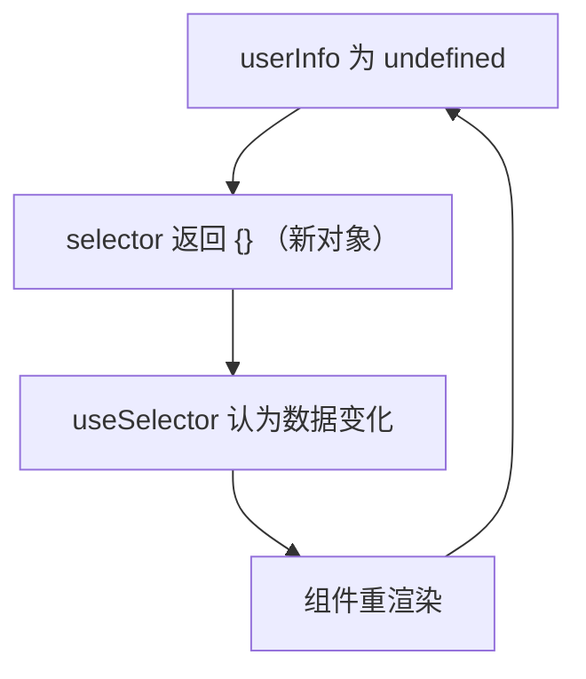
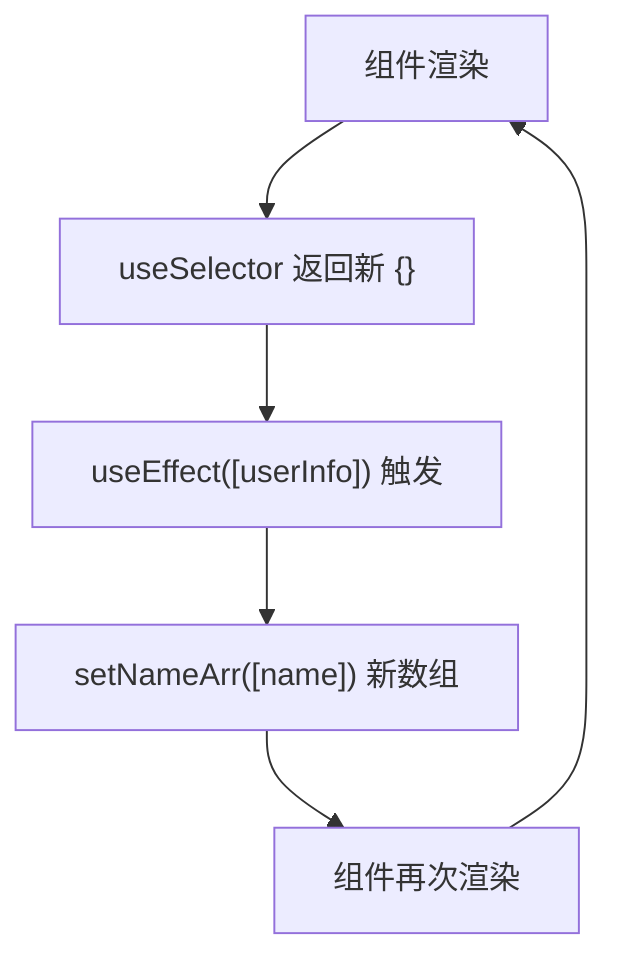

## 问题现象

组件在开发环境**疯狂重渲染**，最终触发警告并卡死：

<div class="callout callout-error">
  <p class="callout-title">Warning: Maximum update depth exceeded</p>
  <p>This can happen when a component calls <code>setState</code> inside <code>useEffect</code>, but <code>useEffect</code> either doesn't have a dependency array, or one of the dependencies changes on every render.</p>
</div>

| 维度 | 情况 |
|------|------|
| 触发代码 | `useAppSelector(state => state.app.userInfo \|\| {})` |
| 初始状态 | `userInfo` 为 `undefined` |
| 表现 | 理论 2～4 次渲染，实际 50+ 次甚至无限循环 |
| 接口无数据时 | 可能**永久卡死** |

## 问题代码

### 典型空引用写法

```typescript
const userInfo = useAppSelector(
  state => state.app.userInfo || {} /* 每次都是新对象 */
);
```

`useAppSelector` 即 `react-redux` 的 `useSelector`，`useAppDispatch` 同理。

### 引发无限循环的版本

```tsx
const UserInfo = () => {
  const userInfo = useAppSelector(state => state.app.userInfo || {});
  const dispatch = useAppDispatch();
  const [nameArr, setNameArr] = useState<string[]>([]);

  useEffect(() => {
    dispatch(updateUserInfo(userInfo.phone));
  }, [userInfo.phone]);

  useEffect(() => {
    setNameArr([userInfo.name]); // 每次返回新数组
  }, [userInfo]); // userInfo 每次都是新 {}

  console.log("函数重新执行了");
  return <h1>{nameArr}</h1>;
};
```

## 根因分析

### useSelector 的比较机制

`useSelector` 对 selector **返回值**做**引用相等**（`===`）比较：

- 返回值与上次相同 → 不触发重渲染
- 返回值不同 → 订阅组件重渲染



**关键：`|| {}` 在每次 selector 执行时都会创建一个全新的空对象。**

### 无限循环链路



| 步骤 | 说明 |
|------|------|
| 1 | `userInfo` 为 `undefined`，selector 返回**新** `{}` |
| 2 | `useEffect` 依赖 `[userInfo]`，引用变了 → 执行 `setNameArr` |
| 3 | `setNameArr([userInfo.name])` 返回**新数组** → 触发渲染 |
| 4 | 重新渲染 → selector 再次返回**新** `{}` → 回到步骤 2 |

### 为何 `setNameArr('')` 不会死循环？

去掉 `|| {}` 后，`userInfo` 在数据到达前稳定为 `undefined`，`useEffect` 依赖不再每次变化。此时 `setNameArr('')` 因**值相等**（`Object.is('', '')`）被 React 跳过，不会额外触发渲染：

```tsx
const userInfo = useAppSelector(state => state.app.userInfo); // 不再 || {}

useEffect(() => {
  setNameArr(''); // 字符串是基本类型，值相同则不触发渲染
}, [userInfo]);
```

| 类型 | 比较方式 | 重复 set 相同「空值」 |
|------|----------|------------------------|
| 字符串 `''` | 值相等 | 不触发渲染 ✅ |
| 数组 `[]` | 引用比较 | 每次都是新引用，触发渲染 ❌ |
| 对象 `{}` | 引用比较 | 每次都是新引用，触发渲染 ❌ |

**复现验证**见下文「复现环境」一节。

| 场景 | 渲染次数 |
|------|----------|
| `\|\| {}` + `useEffect` + `setNameArr([...])` | **51+ 次**，触发 Maximum update depth（原文 Chrome 实测） |
| 去掉 `\|\| {}` + `setNameArr('')` | **有限次**，不触发 Maximum update depth |
| 理想写法 / useMemo 写法 | **3 次**（初始化 + 数据到达 + `phone` 变化触发 `dispatch`） |

> 单独 `|| {}` 会让 selector 每次返回新引用；与 `useEffect` + `setState(新引用)` 组合后才会形成死循环。

### Hooks 相关原理

| Hook | 行为 |
|------|------|
| 函数组件 | 每次渲染 = 重新执行整个函数，局部变量重新创建 |
| `useState` | 新 state 与旧 state 比较，相同则跳过渲染 |
| `useSelector` | selector 返回值与上次比较，相同则跳过渲染 |
| `useCallback` | 缓存函数引用，依赖不变则复用 |
| `useMemo` | 缓存计算结果，依赖不变则复用 |

## 理论 vs 实际渲染次数

**理想情况（数据流清晰）：**

```tsx
const UserInfo = () => {
  const userInfo = useAppSelector(state => state.app.userInfo);
  const dispatch = useAppDispatch();

  useEffect(() => {
    dispatch(updateUserInfo(userInfo?.phone));
  }, [userInfo?.phone]);

  console.log("函数重新执行了");
  return <h1>{userInfo?.name}</h1>;
};
```

| 阶段 | 次数 |
|------|------|
| 初始化 | 1 次 |
| Redux 数据到达 | +1 次 |
| `userInfo.phone` 变化 → `useEffect` 内 `dispatch` | +1 次 |
| **合计** | **3 次** ✅ |

**问题版本理论次数（无循环时）：** 约 4 次（初始化 + setState + dispatch 更新 + setState），但实际因 `{}` 引用问题 → **无限次**。

## 修复方案

### 方案 1：去掉 `|| {}`，使用可选链（推荐）

```tsx
const userInfo = useAppSelector(state => state.app.userInfo);

// 使用时
userInfo?.name
userInfo?.phone
```

Redux 初始 state **不要设为 `undefined`**，使用明确默认值：

```typescript
const initialState = {
  userInfo: null as UserInfo | null, // 或 {}
};
```

若必须用 `{}`，在 **reducer 层**定义一次，不要在 selector 里每次创建：

```typescript
const EMPTY_USER = {};
const selectUserInfo = (state: RootState) => state.app.userInfo ?? EMPTY_USER;
```

### 方案 2：useMemo 派生展示数据

```tsx
const UserInfo = () => {
  const userInfo = useAppSelector(state => state.app.userInfo);
  const dispatch = useAppDispatch();

  useEffect(() => {
    dispatch(updateUserInfo(userInfo?.phone));
  }, [userInfo?.phone]);

  const nameArr = useMemo(() => {
    return [userInfo?.name];
  }, [userInfo?.name]); // 依赖具体字段，而非整个对象

  return <h1>{nameArr}</h1>;
};
```

数据到达后共 **3 次**执行，不会陷入循环。

### 方案 3：避免在 useEffect 中 setState 依赖不稳定引用

```tsx
// ❌ 依赖整个 userInfo 对象（可能是新 {}）
useEffect(() => { ... }, [userInfo]);

// ✅ 依赖具体字段
useEffect(() => { ... }, [userInfo?.phone]);
useEffect(() => { ... }, [userInfo?.name]);
```

## 经验总结

1. **永远不要在 selector 里写 `|| {}` / `|| []`**——每次渲染产生新引用
2. `useSelector` 使用**引用相等**比较，对象/数组默认值必须在组件外或 reducer 中定义
3. `useEffect` 依赖项避免不稳定引用；优先依赖**原始值字段**（`userInfo?.name`）
4. Redux 初始 state 用 `null` 或稳定的空对象，避免 `undefined` + 兜底对象的组合
5. 排查渲染次数：对比**理论执行次数**与 `console.log` 实际次数，差异大时先查引用稳定性

## 复现环境

与原文相同的 **create-react-app** 技术栈，核心依赖版本如下（2022 年前后 CRA 5 默认组合）：

| 项 | 版本 |
|----|------|
| create-react-app / react-scripts | 5.0.1 |
| react / react-dom | 18.2.0 |
| react-redux | 8.0.5 |
| @reduxjs/toolkit | 1.8.6 |

**复现步骤：**

1. `npx create-react-app@5.0.1 my-app --template redux`（或手动安装上表依赖）
2. 将文中 `UserInfo` 组件粘贴进项目，保留 `console.log("函数重新执行了")`
3. `npm start`，在 **Chrome** 开发者工具 Console 观察执行次数与 Warning
4. 使用 CRA 自带的 `react-scripts test`（Jest + jsdom）对去掉 `|| {}` 的写法做补充验证

**验证结论：**

| 验证项 | 结果 |
|--------|------|
| `state.app.userInfo \|\| {}` 连续两次调用 | 返回不同引用 |
| 问题版本（`setNameArr([...])`） | 原文记录 **51 次** log 后出现 Maximum update depth |
| `setNameArr('')` 版本 | 不触发无限循环 |
| 理想 / useMemo 写法 | 数据到达后共 **3 次** |

## 参考

- [React Redux: useSelector](https://react-redux.js.org/api/hooks#useselector)
- [React: useMemo](https://react.dev/reference/react/useMemo)
