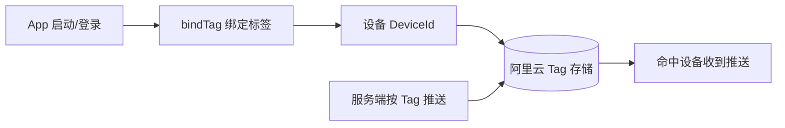
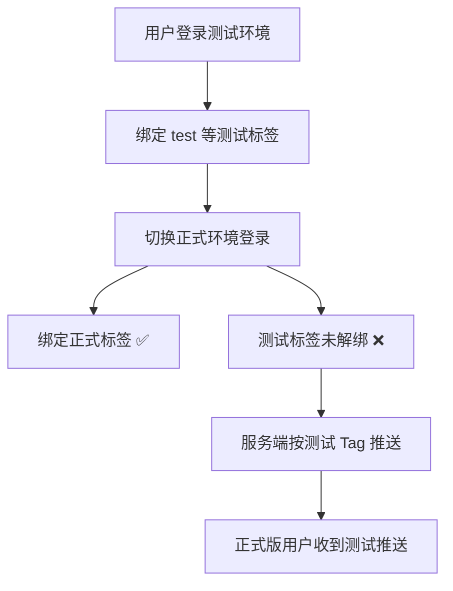
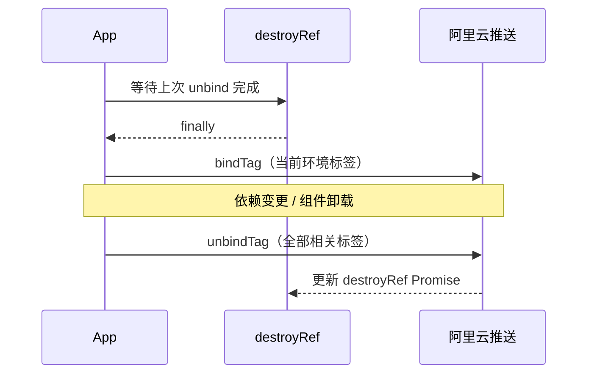

## 问题现象

正式版 App 用户收到来自公司 App 的异常推送（乱码/测试文案），而用户安装的是**正式版**，理论上不应收到开发/测试环境的推送。

| 维度 | 情况 |
|------|------|
| 影响范围 | 曾登录过测试环境的用户 |
| 复现条件 | 测试同学在新环境无法复现；问题用户有测试环境使用历史 |
| 初步排除 | 当前代码逻辑、手机型号 |

## 技术栈

- **推送服务**：阿里云移动推送（EMAS）
- **客户端**：React Native + [`react-native-aliyun-emas`](https://www.npmjs.com/package/react-native-aliyun-emas)
- **推送策略**：基于**标签（Tag）**定向推送

## 阿里推送标签机制

**推送流程：**



**关键规则（官方文档）：**

- 标签与**设备 ID**绑定，不是与账号绑定
- 一个设备可绑定不限数量标签；一个标签可绑定不限数量设备
- 换设备后，旧设备上的标签不再生效
- 多设备同账号：各设备独立维护标签集合，按 Tag 推送时取**并集**

**多设备标签示例：**

| 设备 | 已绑定标签 | 推送 Tag=`c` | 推送 Tag=`a` |
|------|-----------|-------------|-------------|
| 设备 A | a, b, c | ✅ 收到 | ✅ 收到 |
| 设备 B（同账号） | c, d, f | ✅ 收到 | ❌ 收不到 |

## 根因分析

### 问题代码（旧版）

登录/登出时只绑定新标签，**未完整解绑历史标签**：

```typescript
useEffect(() => {
  const allPush = allPhoneTag;
  const accountPush = accountTag;
  if (token) {
    AliyunPush.bindTag(1, [allPush, accountPush, eventId], '');
    AliyunPush.unbindTag(1, [noAccountTag], ''); // 仅解绑 noAccountTag
    return () => {
      AliyunPush.unbindTag(1, [allPush, accountPush, noAccountTag], '');
    };
  } else {
    AliyunPush.bindTag(1, [allPush, noAccountTag], '');
    AliyunPush.unbindTag(1, [accountPush, eventId], ''); // 未解绑测试环境标签
  }
}, [accountTag, allPhoneTag, eventId, noAccountTag, token, /* ... */]);
```

**缺陷链路：**



**结论：** 用户只要曾登录测试环境，测试标签就会**永久残留**在设备上。后续代码虽已修复 bind/unbind 顺序，但**不会自动清理已残留的历史脏数据**。

### 排查过程摘要

| 嫌疑人 | 结论 |
|--------|------|
| 当前代码逻辑 | ✅ 已修复，逻辑正确 |
| 标签存储数据 | ⚠️ 无法直接查库，但可推断存在历史脏标签 |
| 账户/环境 | ✅ 问题账号下存在测试环境标签 |
| 手机型号 | ❌ 基本排除 |

## 修复方案

### 1. 绑定前先完成解绑（保证顺序）

使用 `destroyRef` 确保**先解绑、再绑定**，避免异步竞态导致「先绑后解」：

```typescript
const initTag = useCallback(() => {
  const tempAccountTag = accountTag;
  const tempEventId = eventId;
  const tempNoAccountTag = noAccountTag;
  const tempAllPhoneTag = allPhoneTag;

  destroyRef.current.finally(async () => {
    await AliyunPush.bindTag(
      1,
      token
        ? [tempAllPhoneTag, tempAccountTag, tempEventId]
        : [tempAllPhoneTag, tempNoAccountTag],
      '',
    );
  });

  return async () => {
    destroyRef.current = AliyunPush.unbindTag(
      1,
      [tempAccountTag, tempEventId, tempNoAccountTag, tempAllPhoneTag],
      '',
    );
  };
}, [accountTag, allPhoneTag, eventId, noAccountTag, token]);

useEffect(() => {
  return initTag();
}, [initTag]);
```

### 2. 清理历史脏标签

- 利用阿里云 API **查询当前设备已绑定的全部标签**
- 每次重新绑定时，**先解绑所有已知/历史标签**，再绑定当前环境应有的标签
- 对存量用户：发版后首次启动即完成一次全量清理

### 3. 避免 useEffect 异步任务堆积

`useEffect` 中依赖频繁变化时，会连续触发多次 bind/unbind，异步任务堆积导致**执行顺序不可控**。

**建议：**

- 用 `destroyRef` / AbortController 串行化异步操作
- 或改用专门的状态机/队列管理标签生命周期
- 参考：[用 useEffect 优雅管理 React 中的异步操作](https://juejin.cn/post/7429369513424273408)

**修复后的执行顺序：**



## 经验总结

1. **数据类 Bug 必须考虑历史数据**——旧逻辑缺陷产生的脏数据，不会随代码修复自动消失
2. **标签/订阅类功能要有「全量清理 + 增量绑定」策略**，不能只做增量 bind
3. **环境切换（测试 ↔ 正式）** 是标签类推送的高危场景，需单独验证
4. **useEffect + 异步副作用** 要注意依赖抖动和任务乱序，关键路径应串行化
