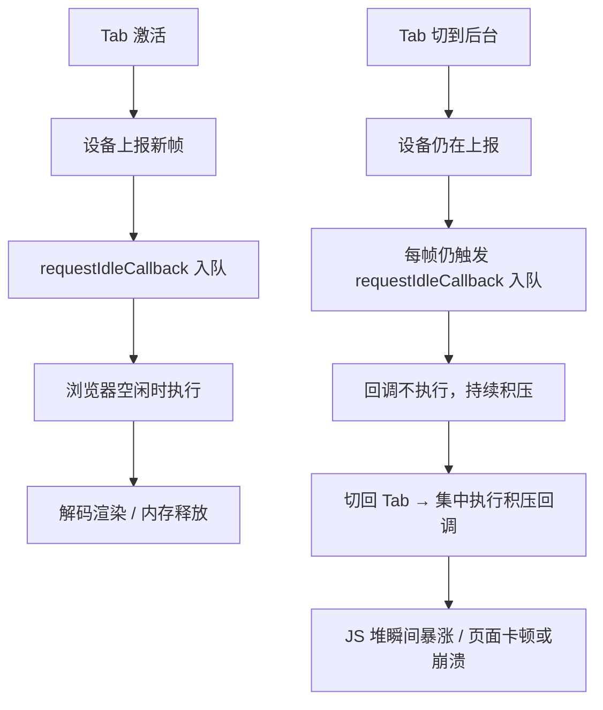
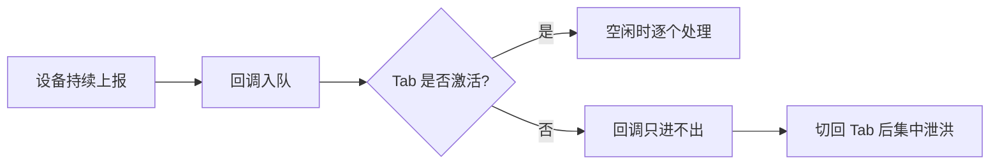

## 问题现象

离开浏览器 Tab 一段时间后（去做其他事、下班未关页等），再次切回时页面**崩溃**或**明显变卡**。

| 维度 | 情况 |
|------|------|
| 业务场景 | 串口接收设备上报的 base64 图片，持续渲染形成「视频流」效果 |
| 初步怀疑 | 内存泄漏 |
| 内存工具结论 | 每次释放后内存能回到之前水平，**未发现典型泄漏** |
| 线上/旧版本 | 线上无法复现；测试 overnight 操作旧版本也无问题 |
| 浏览器 | 仅在 Chrome 中验证（其他浏览器需单独测试） |

## 业务背景


- 数据源头：设备通过串口连接，持续上报图片帧
- 前端：**有数据到达即触发处理**，解码 base64 并渲染，形成「视频流」效果

## 排查过程摘要

| 步骤 | 结论 |
|------|------|
| Chrome DevTools 内存分析（约 1h） | 无泄漏，GC 后内存回落 |
| 逐行审查新增代码 | 无明显问题 |
| 线上环境复现 | 失败 |
| 测试旧版本 overnight | 问题不存在 → 锁定**新增代码** |
| 性能面板长期开启 + 刻意切换 Tab | **发现根因** |

**关键观察：** Tab 处于非激活状态一段时间后切回，JS 堆大小**瞬间飙高**，随后才缓慢回落——说明离开期间有任务在**堆积**，而非持续泄漏。

## 根因分析

### 问题代码

```javascript
serial.onData((base64Image) => {
  requestIdleCallback(() => {
    // 解码 base64、渲染图片等耗时逻辑
    decodeAndRender(base64Image);
  });
});
```

### requestIdleCallback 在后台 Tab 的行为



**核心机制（Chrome）：**

- Tab **非激活**时，`requestIdleCallback` 的回调**不会执行**
- 回调会被**缓存**，待 Tab 再次激活后**集中执行**
- 若回调内处理 base64 图片等重逻辑，短时间大量执行 → 内存峰值、主线程阻塞

**积压机制：**



即使断开设备连接，**队列里已积压的回调仍会执行**，所以图像可能「还在动」。

## 修复方案

### 方案 1：为 requestIdleCallback 设置 timeout（缓解）

```javascript
serial.onData((base64Image) => {
  requestIdleCallback(
    () => {
      decodeAndRender(base64Image);
    },
    { timeout: 100 }, // 最多等待 100ms，超时后强制执行
  );
});
```

`timeout` 保证即使 Tab 后台，回调也会在指定时间内执行，避免无限堆积。

> 并非完全保险，仅适合必须保留 `requestIdleCallback` 的场景。

### 方案 2：改用 setTimeout / 同步处理（推荐）

对于「持续接收 + 必须及时处理」的流式场景：

- 直接用 `setTimeout(fn, 0)` 或同步处理
- Tab 不可见时**暂停消费串口数据**（`document.visibilitychange`）
- 或在组件卸载 / 页面隐藏时**断开监听 + 取消未执行的 idle 回调**

```javascript
let idleId = null;

document.addEventListener("visibilitychange", () => {
  if (document.hidden) {
    serial.pause(); // 或移除 onData 监听
    if (idleId !== null) cancelIdleCallback(idleId);
  } else {
    serial.resume();
  }
});
```

## 经验总结

1. **`requestIdleCallback` 不适合处理持续、不可丢失的后台任务**——后台 Tab 会暂停 idle 回调
2. **内存不涨 ≠ 无问题**——任务堆积会在切回 Tab 时以「峰值」形式爆发
3. **性能面板 + 刻意切换 Tab** 比纯 Memory 快照更适合排查此类问题
4. 使用 `requestIdleCallback` 时必须理解 **`timeout` 选项**，并考虑 `cancelIdleCallback` 做清理
5. 流式数据场景应结合 **`Page Visibility API`** 在后台暂停消费

## 参考

- [MDN: requestIdleCallback](https://developer.mozilla.org/en-US/docs/Web/API/Window/requestIdleCallback)
- [MDN: Page Visibility API](https://developer.mozilla.org/en-US/docs/Web/API/Page_Visibility_API)
