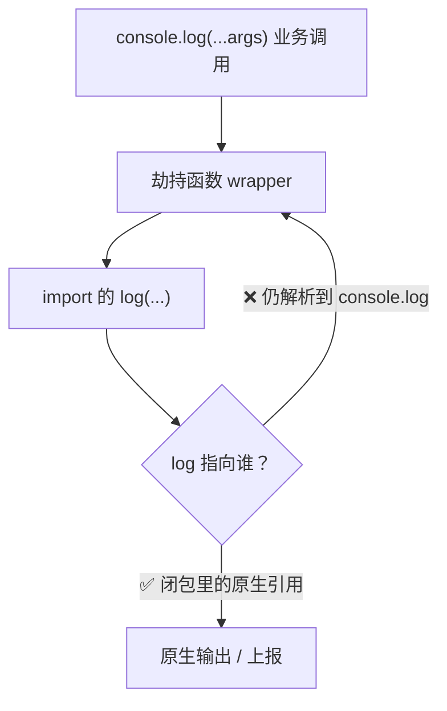

## 一句话

**把 `console.log` 命名导出，再 `console.log = () => log()` 做全局劫持——Android 上会栈溢出；换成 default export 的 `logger.log` 就正常。**

## 问题现象

在 **Android WebView / RN 容器**里做日志统一上报：先封装 logger，再全局重写 `console.log` 走自定义逻辑。

| 维度 | 情况 |
|------|------|
| 写法 A | `export const [log, …] = [console.log, …]` + `import { log }` + 重写 `console.log` |
| 写法 B | `export default logger`（对象方法内调用闭包里的 `log`）+ `import logger` |
| 写法 A | **栈溢出 / 无限递归**，页面卡死 |
| 写法 B | **正常** |
| 验证环境 | Android 真机 / WebView（桌面 Chrome 有时不易复现） |

## 问题代码 vs 正确代码

### ❌ 会递归

**logger.ts**

```typescript
export const [log, warn, error] = [console.log, console.warn, console.error]
```

**入口 / 拦截处**

```typescript
import { log } from './logger'

console.log = (...data: any[]) => {
  log(...data)   // ← 期望调用「原生 log」，实际陷入递归
}
```

### ✅ 正常

**logger.ts**

```typescript
const [log, warn, error] = [console.log, console.warn, console.error]

const logger = {
  log: (...data: any[]) => {
    log(...data)   // 闭包捕获模块加载时的 log
  },
  warn: (...data: any[]) => {
    warn(...data)
  },
  error: (...data: any[]) => {
    error(...data)
  },
}

export default logger
```

**入口 / 拦截处**

```typescript
import logger from './logger'

console.log = (...data: any[]) => {
  logger.log(...data)   // 走对象方法，不递归
}
```

## 期望 vs 实际

| 步骤 | 期望 | 实际（写法 A） |
|------|------|----------------|
| 1. 模块加载 | `log` 保存原生 `console.log` 引用 | 引用看似已保存 |
| 2. 重写 `console.log` | 新函数 → 调用原生 `log` | 新函数 → 调用 `log` |
| 3. 执行 `log(...)` | 输出到原生控制台 | **再次进入**已重写的 `console.log` |
| 4. 结果 | 打印一次 | **RangeError: Maximum call stack size exceeded** |



## 根因分析

### 为什么会递归？

劫持的本质是：

```
新的 console.log  →  自定义逻辑  →  原生 console.log
```

写法 A 断裂在最后一环：**`import { log }` 拿到的并不一定是「模块加载那一刻的原生函数」**。

| 原因 | 说明 |
|------|------|
| **活绑定 / 桥接方法** | Android WebView 里 `console.log` 可能是宿主桥接方法，提取后调用仍 dispatch 到 **`console.log` 当前槽位** |
| **Bundler 内联** | Metro / Webpack 可能把命名导出 `log` 优化成对全局 `console.log` 的访问，重写后 import 的 `log` 与 `console.log` 同源 |
| **隐式包装** | 若写成 `export const log = (...a) => console.log(...a)`（而非直接引用），重写后必递归 |

一旦 `log(...)` 内部仍走到**已被重写**的 `console.log`，调用链闭合：

```
console.log → wrapper → log → console.log → wrapper → …
```

### 写法 B 为什么没问题？

```typescript
const [log, warn, error] = [console.log, console.warn, console.error]
//     ↑ 模块私有 const，仅在模块初始化时求值一次

const logger = {
  log: (...data) => { log(...data) }
  //                  ↑ 闭包捕获上面的 const log，不是 export 绑定
}
```

| 对比 | 命名导出 `log` | `logger.log` 方法 |
|------|---------------|-------------------|
| 导出方式 | `export const log = …` 可被 bundler 当公共符号处理 | `default export` 对象，方法为独立函数 |
| 调用路径 | 劫持处直接 `log()` | 劫持处 `logger.log()` → 闭包内 `log()` |
| 与 `console.log` 槽位 | 易耦合 | **解耦**，闭包持有初始化时的引用 |

## 修复方案

### 方案 1（推荐）：模块内 capture + default export 对象

```typescript
const nativeLog = console.log.bind(console)
const nativeWarn = console.warn.bind(console)
const nativeError = console.error.bind(console)

const logger = {
  log: (...data: any[]) => nativeLog(...data),
  warn: (...data: any[]) => nativeWarn(...data),
  error: (...data: any[]) => nativeError(...data),
}

export default logger
```

`.bind(console)` 确保 `this` 正确，且引用在**重写前**固定。

### 方案 2：显式保存原生引用，不 export 裸 console 方法

```typescript
// ❌ 不要
export const log = console.log
export const log = (...args: any[]) => console.log(...args)

// ✅ 可以
const _log = console.log.bind(console)
export function log(...args: any[]) {
  _log(...args)
}
```

若必须命名导出，export 的应是**调用闭包变量**的 wrapper，且闭包变量 `_log` 不 export。

### 方案 3：劫持时使用 logger，且避免在 wrapper 里写 `console.log`

```typescript
import logger from './logger'

console.log = (...data: any[]) => {
  // 上报逻辑
  sendToServer('log', data)
  logger.log(...data)   // 永远走 logger，不要 console.log(...)
}
```

## 经验总结

1. **不要 `export const log = console.log` 再全局重写 `console.log`**——Android WebView 上极易递归
2. 劫持全局 `console.*` 时，原生方法必须在模块顶层 **`const native = console.log.bind(console)`** 一次性 capture
3. 用 **default export 对象 + 闭包**，不要 export 裸的 console 方法引用
4. wrapper 函数体内**禁止**再写 `console.log(...)`，只调 capture 后的 `nativeLog` 或 `logger.log`
5. 桌面浏览器不一定复现，**以 Android 真机为准**验证日志劫持

## 参考

- [MDN: console.log](https://developer.mozilla.org/en-US/docs/Web/API/console/log)
- [MDN: Function.prototype.bind](https://developer.mozilla.org/en-US/docs/Web/JavaScript/Reference/Global_objects/Function/bind)
