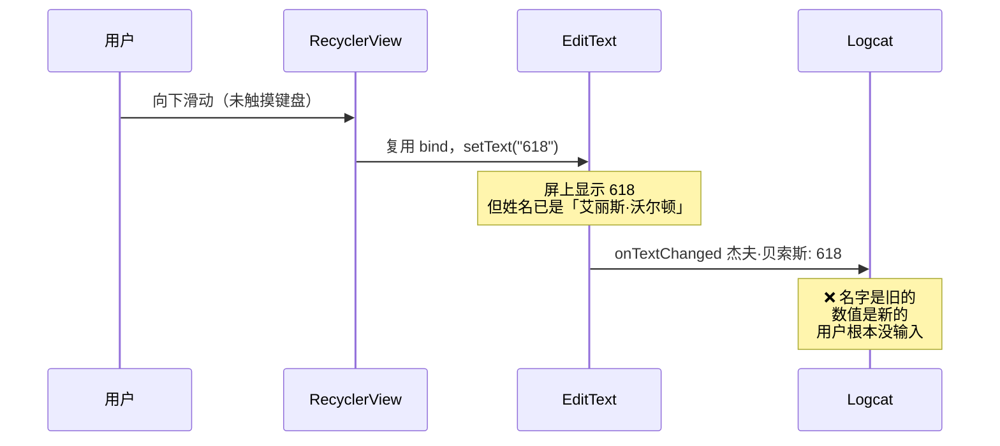
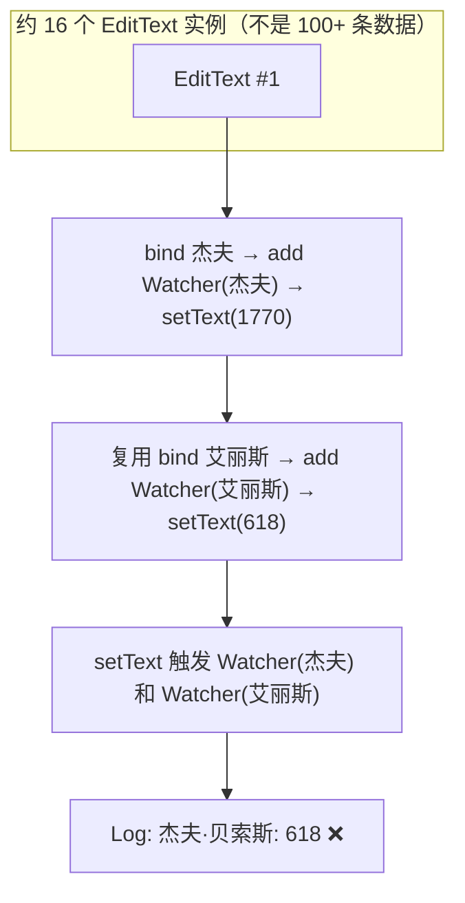
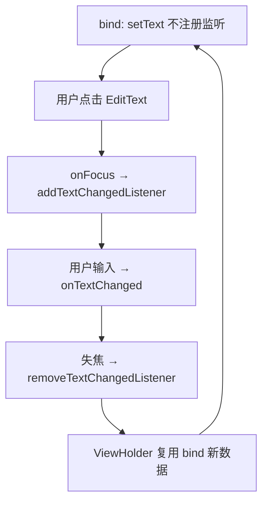

## 一句话

**手指没碰键盘，只是滑了一下列表，控制台就开始疯狂打印 `onTextChanged`，富豪们的财富值还越变越少。**

## Demo 场景

列表数据来自福布斯富豪榜，每项结构：

| 姓名（TextView） | 财富（EditText，单位：亿美元） |
|------------------|-------------------------------|
| 杰夫·贝索斯 | `1770` |
| 埃隆·马斯克 | `1510` |
| 比尔·盖茨 | `1240` |
| … | … |

业务逻辑：`onTextChanged` 里把 EditText 的值写回 `Data.wealth`，用于提交后端。

## 期望 vs 实际

| | 期望 | 实际 |
|---|------|------|
| **操作** | 打开 App → 向下滑动列表 | 同上 |
| **用户输入** | 无 | 无 |
| **控制台** | 安静，无输出 | 大量 `onTextChanged` |
| **杰夫·贝索斯财富** | 始终 `1770` | 日志里出现 `618`、`418`、`390`… |
| **同一行数据** | 姓名和数值一一对应 | 杰夫的名字配上了别人的数值 |



## 关键日志：只看这三行就懂

滑动列表后，Logcat **交替**出现 `Holder init` 和 `onTextChanged`：

```
I/吴敬悦: onTextChanged 杰夫·贝索斯: 618      ← 没输入，1770 怎么变 618？
I/吴敬悦: onTextChanged 埃隆·马斯克: 602      ← 没输入，1510 怎么变 602？
...
I/吴敬悦: onTextChanged 杰夫·贝索斯: 418      ← 同一个人，又一个新数字
I/吴敬悦: onTextChanged 艾丽斯·沃尔顿: 418    ← 不同人，同一个数字
I/吴敬悦: onTextChanged 埃隆·马斯克: 392
I/吴敬悦: onTextChanged 吉姆·沃尔顿: 392      ← 392 被打印了两次，给了两个不同的人
```

**三个反常点：**

| # | 反常 | 含义 |
|---|------|------|
| 1 | 没碰键盘就有 `onTextChanged` | 不是用户输入，是 `setText` 触发的 |
| 2 | 同一名字出现多个不同数值 | 杰夫·贝索斯：`618` → `418` → `390` |
| 3 | 不同名字出现相同数值 | `418` 同时出现在杰夫和艾丽斯；`392` 同时出现在埃隆和吉姆 |

第 3 点最直观：**一个数字被当成了多个人的财富写回数据库**——这就是「简单魔法让大佬财富减少」。

## 错位对照表

以滑动到底部附近的一次 bind 为例（真实日志摘录）：

| 日志：`onTextChanged 姓名: 数值` | 该姓名真实财富 | 屏上实际 setText 的值属于 |
|--------------------------------|---------------|--------------------------|
| 杰夫·贝索斯: **418** | 1770 | 艾丽斯·沃尔顿（618 屏）的复用残留 |
| 埃隆·马斯克: **392** | 1510 | 吉姆·沃尔顿（602 屏）的复用残留 |
| 比尔·盖茨: **382** | 1240 | 迈克尔·布隆伯格（590 屏）的复用残留 |
| 马克·扎克伯格: **377** | 970 | 黄峥（553 屏）的复用残留 |

**结论：** 回调里的 `name` 来自**旧 Watcher 闭包**，`value` 来自**当前 setText**——两者不是同一条数据。

## 问题代码

典型写法：在 `onBindViewHolder` / `bind` 里 **add** TextWatcher（不是 replace）：

```kotlin
fun bind(d: Data, position: Int) {
    text?.text = d.name
    input?.setText(d.wealth.toString())

    input?.addTextChangedListener(object : TextWatcher {
        override fun onTextChanged(s: CharSequence?, start: Int, before: Int, count: Int) {
            d.wealth = s.toString().toInt()   // ← 写入了错位的数据
            Log.i(TAG, "onTextChanged ${d.name}: $s")
        }
    })
}
```

## 根因分析

### 为什么滑动就会触发？



| 机制 | 说明 |
|------|------|
| RecyclerView 复用 | 100 条数据，只有 ~16 个 EditText 实例 |
| `addTextChangedListener` | **追加**到 `mListeners` 列表，不会替换旧的 |
| 复用 bind 时 `setText` | 触发该 EditText 上**所有** Watcher 的 `onTextChanged` |
| 匿名类捕获 `d` | 旧 Watcher 里的 `d.name` 仍是上一次绑定的人 |

### addTextChangedListener 源码

```java
public void addTextChangedListener(TextWatcher watcher) {
    if (mListeners == null) {
        mListeners = new ArrayList<TextWatcher>();
    }
    mListeners.add(watcher);  // 追加，不移除旧监听
}
```

| 行为 | 后果 |
|------|------|
| 每次 bind 都 add | 一个 EditText 上挂**多个** TextWatcher |
| 复用时 `setText` | 触发**所有**已注册监听器的 `onTextChanged` |
| 匿名类捕获 bind 时的 `d` | 旧监听仍引用**上一次**绑定的姓名 |

## 错误尝试

### 尝试 1：每条数据一个 OwnTextWatcher

```kotlin
class OwnTextWatcher(private val name: String) : TextWatcher {
    override fun onTextChanged(s: CharSequence?, ...) {
        Log.i(TAG, "onTextChanged $name: $s")
    }
}

// bind 时
input?.addTextChangedListener(OwnTextWatcher(d.name))
```

| 预期 | 实际 |
|------|------|
| 100 个 Data → 100 个独立 Watcher | init 数量 ≈ 数据量，但 EditText 仍只有 ~16 个 |
| 一对一绑定 | **仍是一对多**：同一 EditText 累积多个 Watcher |

### 尝试 2：全局 currentData + 仅在 ViewHolder init 注册一次

```kotlin
companion object {
    private var currentData: Data? = null
}

init {
    input?.addTextChangedListener(object : TextWatcher {
        override fun onTextChanged(s: CharSequence?, ...) {
            Log.i(TAG, "onTextChanged ${currentData?.name}: $s")
        }
    })
}

fun bind(d: Data, position: Int) {
    currentData = d
    input?.setText(d.wealth.toString())
}
```

**能工作**，但 `currentData` 是全局变量，多 ViewHolder 并发绑定时存在竞态。

## 修复方案

### 修复前后对比

| | 问题写法 | 获焦注册（推荐） |
|---|---------|-----------------|
| 滑动列表 | Logcat 狂刷 `onTextChanged` | **无输出** |
| 杰夫·贝索斯财富 | 被写成 618、418… | 保持 1770 |
| EditText 上 Watcher 数 | 滑动后堆积 5+ 个 | 最多 1 个（编辑中） |
| 用户点击输入 | 同样错乱 | 只回调当前行 |

### 方案 1（推荐）：获焦注册、失焦移除

只在用户**真正编辑**时监听，复用 `setText` 不触发业务回调：

```kotlin
fun bind(d: Data, position: Int) {
    text?.text = d.name
    input?.setText(d.wealth.toString())

    val watcher = object : TextWatcher {
        override fun onTextChanged(s: CharSequence?, start: Int, before: Int, count: Int) {
            d.wealth = s.toString().toIntOrNull() ?: d.wealth
            Log.i(TAG, "onTextChanged ${d.name}: $s")
        }
        // beforeTextChanged / afterTextChanged ...
    }

    input?.onFocusChangeListener = View.OnFocusChangeListener { _, hasFocus ->
        if (hasFocus) {
            input?.addTextChangedListener(watcher)
        } else {
            input?.removeTextChangedListener(watcher)
        }
    }
}
```



| 优点 | 说明 |
|------|------|
| 复用 setText 不触发 | 失焦后无监听，滑动绑定安全 |
| 闭包捕获当前 `d` | 编辑期间 Data 与 Watcher 一一对应 |
| 符合 Android 设计 | `addTextChangedListener` 本就是为多监听场景设计 |

**修复后日志（滑动到底）：**

```
# 只有 Holder init，没有 onTextChanged
I/吴敬悦: Holder init: -------------------------------
I/吴敬悦: Holder init: -------------------------------
...
# 用户点击某行输入后才出现
I/吴敬悦: onFocusChange: true
I/吴敬悦: onTextChanged 杰夫·贝索斯: 1771
```

### 方案 2：bind 前先 removeTextChangedListener

若必须在 bind 时注册，需**先清再绑**，并避免在 `onBindViewHolder` 里反复 add：

```kotlin
private var watcher: TextWatcher? = null

fun bind(d: Data, position: Int) {
    watcher?.let { input?.removeTextChangedListener(it) }
    watcher = object : TextWatcher { /* 使用 d */ }
    input?.addTextChangedListener(watcher)
    input?.setText(d.wealth.toString())
}
```

注意：`setText` 仍会在 add 之后触发一次，通常需配合 `TextWatcher` 内 flag 或 `setText` 前临时移除监听。

### 方案 3：不用 EditText，改用单向展示 + 弹窗编辑

列表只展示，点击后 Dialog / 新页面编辑，彻底避开复用与输入框耦合。

## 经验总结

1. **永远不要在 `onBindViewHolder` 里无节制 `addTextChangedListener`**——`add` 是追加，复用会堆积
2. `EditText` 实例数 = ViewHolder 复用数，**不是** item 数
3. 复用绑定的 `setText` 会触发已注册的所有 `TextWatcher`
4. RecyclerView + 可编辑控件：优先**获焦注册 / 失焦移除**，或 bind 前 `removeTextChangedListener`
5. 排查时对比 `Holder init` 次数（≈ 复用池）与 `onTextChanged` 中姓名是否错位

## 验证

使用 **真实 `RecyclerView` + `EditText`**（Robolectric 驱动 Android 框架，非 mock）复现文中逻辑：

| 环境 | 版本 |
|------|------|
| compileSdk | 34 |
| androidx.recyclerview | 1.3.2 |
| 测试 | Robolectric 4.11 + JUnit4 |

| 验证项 | 结果 |
|--------|------|
| `addTextChangedListener` 两次 add 同一 Watcher | `mListeners` 数量为 **2**（追加非替换） |
| 问题 Adapter：同一 ViewHolder 连续 bind 5 次 | 单个 EditText 上堆积 **5** 个 TextWatcher |
| 问题 Adapter：复用 bind 后 `setText` | 触发多个不同 name 的 `onTextChanged` |
| 获焦方案：复用 bind 未获焦 | `onTextChanged` **0** 次 |
| 获焦方案：requestFocus 后 setText | 回调 name 与当前 item **一致** |
| 真实 RecyclerView scrollToPosition(30) | 未获焦时 `onTextChanged` **0** 次 |

## 参考

- [RecyclerView - ViewHolder 复用](https://developer.android.com/reference/androidx/recyclerview/widget/RecyclerView)
- [EditText.addTextChangedListener](https://developer.android.com/reference/android/widget/TextView#addTextChangedListener(android.text.TextWatcher))
