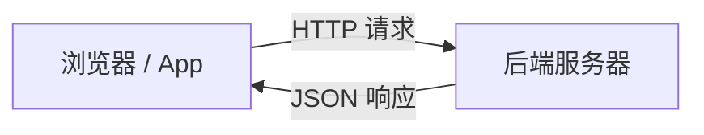
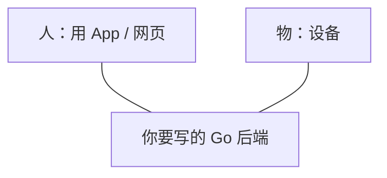
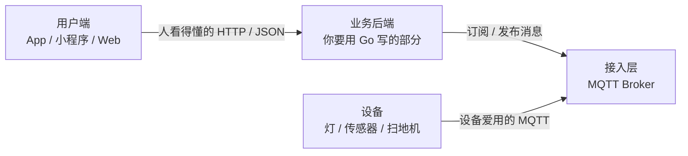
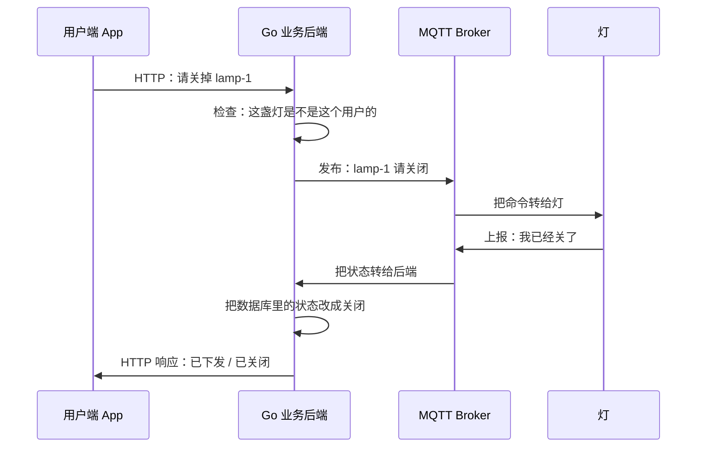

  
这一讲只记一件事

  
物联网后端不是「网站后台的另一个版本」，而是<strong>同时服务人和设备</strong>的中转站。在写任何 Go 代码之前，先认清系统里的四个角色。

## 为什么第一讲不写 Go

你搜「Go 物联网后端」，很容易直接跳到：装 Go、选框架、连 MQTT、写接口。

对小白来说，这是**倒着学**。

原因很简单：物联网后端要解决的问题，和普通网站后台不一样。如果你不知道「设备怎么说话、人怎么下命令、消息从哪进从哪出」，后面选框架、拆目录、写 goroutine，都会变成背步骤。

所以本系列约定：

| 规则 | 含义 |
|------|------|
| 一次只讲一个知识点 | 本讲讲完，先停 |
| 先建立图景，再动手 | 不知道图在哪，就不写代码 |
| 术语当场解释 | 第一次出现的词，立刻用大白话说清 |

## 先忘掉「后端」这个词

做网站时，脑海里通常只有两条线：

人点按钮，服务器查数据库，把结果返回去。连接是**短的**：请求来了处理，处理完就断开。

物联网里多了一个不会点按钮的「用户」：**设备**。

灯、插座、温湿度计、扫地机，它们：

- 不会打开浏览器
- 经常自己上报数据（温度变了、电量低了）
- 需要你远程下命令（开灯、停机）
- 网络可能很差，随时掉线

所以物联网至少是**三方**，不是两方：

人要看状态、下命令；设备要上报、要听话。Go 后端站在中间。

## 四个角色分别是谁

把「三方」再拆细一点，工业上常见的是 **四个角色**。后面所有架构图，都可以先往这四个框里填。

### 1. 设备：真正的「物」

设备就是现场那台硬件：开关、传感器、网关、扫地机。

它通常很「穷」：

| 特点 | 白话 |
|------|------|
| CPU / 内存小 | 跑不了浏览器，也跑不了很重的程序 |
| 网络不稳 | 可能用 4G、Wi-Fi，信号差就断 |
| 自己会说话 | 温度变了就上报，不用等人来问 |
| 需要一个身份证 | 例如 `deviceId`，后端靠它认出「这是哪一盏灯」 |

你**几乎不会**让设备直接去访问「查用户、改订单」那种业务接口。设备只负责：上报自己的状态，执行发给它的命令。

### 2. 接入层（Broker）：设备的邮局

设备不适合直接打 HTTP。业界更常用 **MQTT**。

  
MQTT 是什么（先记住这一句）

  
<strong>一种专门给设备用的发消息方式</strong>：设备连上一台叫 Broker 的服务器，之后可以「发消息」和「收消息」，像邮局，而不是像打开网页。

**Broker**（读作 bro-ker）就是这台邮局：

- 设备连上它，保持一条**长连接**（连着不挂断）
- 设备把消息交给它（发布，publish）
- 谁订阅了这个主题，它就转发给谁（订阅，subscribe）

本讲你只需要知道：**设备一般不直连你的 Go 业务程序，而是先连 Broker。**

常见的 Broker 软件有 EMQX、Mosquitto、HiveMQ。它们不是你第一天就要用 Go 手写的东西；你可以先把它们当成「已经存在的邮局」。

### 3. 业务后端：你真正要用 Go 写的部分

这才是「物联网所对应的后端」。

它干的事，可以先记成三句：

1. **对人**：提供 HTTP API。App 来问「灯开了吗」、来命令「把灯关掉」。
2. **对设备**：通过 Broker 收上报、发控制。灯说「我开了」，你记下；人说「关掉」，你转告灯。
3. **对数据**：存设备状态、历史、用户和设备的绑定关系（这盏灯属于谁）。

所以 Go 后端通常**同时说两种话**：

| 对象 | 常用方式 | 例子 |
|------|----------|------|
| 人 / App | HTTP + JSON | `POST /devices/lamp-1/switch` `{ "on": false }` |
| 设备 | MQTT 消息 | 主题 `device/lamp-1/command`，内容 `{"on":false}` |

很多人一上来就把「物联网后端」理解成「再写一套网站 CRUD」。CRUD 会有，但只是一半。另一半是：**收消息、发消息、处理设备随时掉线**。

### 4. 用户端：人看的界面

手机 App、小程序、Web 管理后台。它们和普通产品一样，走 HTTP 调你的 Go API。

用户端**不需要**懂 MQTT。人看到的是「开关按钮」，不是主题名。

## 用一次「关灯」把四个角色串起来

假设你在 App 里点了「关灯」。完整路径是：

请对照这张图，检查自己是否真的分清了角色：

| 步骤 | 谁在动 | 用的「语言」 |
|------|--------|----------------|
| 点按钮 | 人 → Go | HTTP |
| 校验权限、写意图 | 只有 Go | 业务逻辑 |
| 把命令交给设备 | Go → Broker → 灯 | MQTT |
| 灯汇报结果 | 灯 → Broker → Go | MQTT |
| 人看到关了 | Go → App | HTTP |

  
小白最容易混的一点

  
App <strong>通常不直接给灯发 MQTT</strong>。人走 HTTP，物走 MQTT，中间翻译的人是 Go 后端。这样权限、日志、业务规则都集中在一处，灯也不需要认识每一个用户。

## 和普通 Web 后端的五个不同

认清四个角色之后，差别会变得具体：

| # | 普通 Web 后端 | 物联网后端 |
|---|---------------|------------|
| 1 | 主要服务「人」 | 同时服务「人」和「设备」 |
| 2 | 短连接：请求来了再处理 | 设备常常**长连接**，随时上报 |
| 3 | 几乎只有 HTTP | HTTP + MQTT（后面还会碰到 WebSocket 推送给 App） |
| 4 | 用户掉线最多是「刷新一下」 | 设备掉线是常态：断电、信号差、休眠 |
| 5 | 身份主要是用户账号 | 还要给每台设备发「身份证」（设备认证） |

这五个不同，会直接决定后面怎么用 Go 拆模块。现在先不用记模块名，只要接受：**不能把物联网后端当成多几个 REST 接口的网站。**

## 这一讲你该带走的心智模型

把下面这句话抄下来就够了：

> **Go 物联网后端 = 对人说 HTTP，对设备说 MQTT，自己负责翻译、鉴权和存状态。**

四个角色的职责可以再压成一张表：

| 角色 | 一句话职责 | 你现在要不要写它 |
|------|------------|------------------|
| 设备 | 上报状态、执行命令 | 否（硬件 / 固件） |
| Broker | 帮设备收发消息的邮局 | 否（先用现成软件） |
| **Go 业务后端** | 翻译人话和设备话，管权限和数据 | **是，本系列重点** |
| 用户端 | 给人看、给人点 | 否（App / 前端） |

## 自我检查

不看上文，试着回答：

1. 用户点「关灯」，消息先到谁？再到谁？
2. 为什么设备一般不直连 Go，而要经过 Broker？
3. 你要用 Go 写的，是四个角色里的哪一块？

参考答案：

1. 先到 Go 业务后端（HTTP），再经 Broker 到灯（MQTT）。
2. 设备适合长连接、发消息；Broker 就是干这个的邮局。Go 适合处理业务，不必自己先当几万台设备的连接入口。
3. 业务后端。Broker 先用现成的，设备固件和 App 不是本系列第一阶段。

如果这三题能用自己的话答出来，第一讲就过关了。

## 下一讲预告

下一讲只讲一个问题：

**设备为什么常用 MQTT，而不是像 App 那样直接调 HTTP？**

那一讲会解释 publish / subscribe、主题（topic）、为什么弱网下 MQTT 更合适。仍然不装 Go、不写项目。

本系列后续顺序（先看目录，不展开）：

1. 四个角色 ← 本讲
2. 为什么是 MQTT
3. 为什么物联网后端常用 Go
4. 最小可运行的目录该长什么样
5. 设备身份：deviceId 和认证
6. 一条控制命令在 Go 里怎么走完
